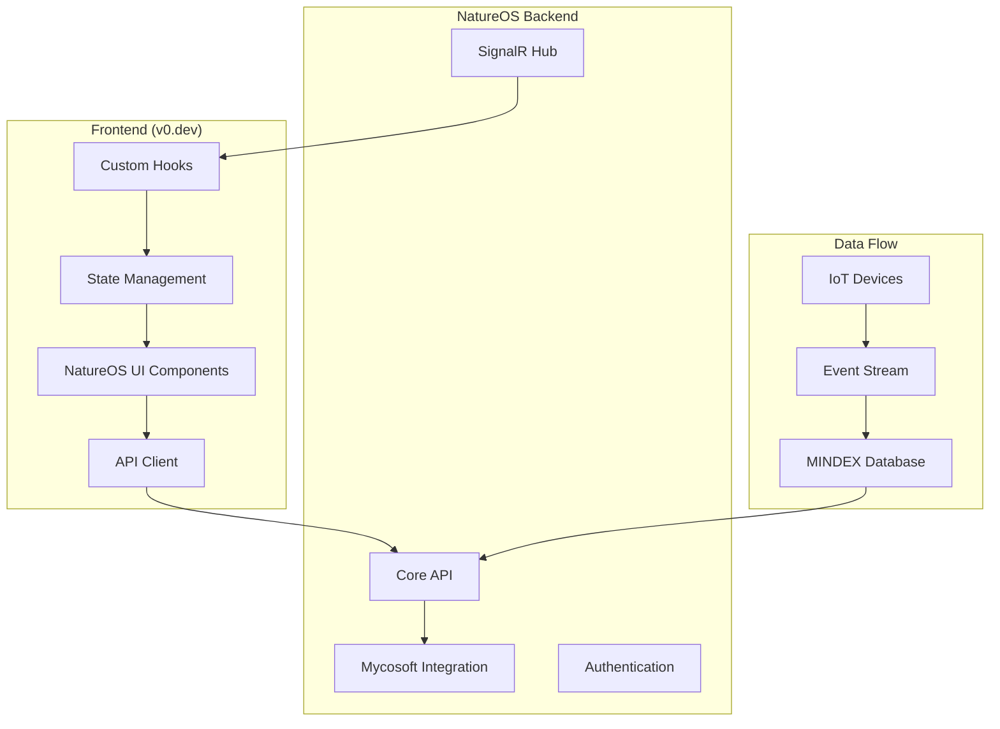

# 🌐 NatureOS Frontend Integration Guide

## 📋 Overview

This guide provides step-by-step instructions to integrate your **v0.dev-generated NatureOS frontend** with the **NatureOS backend system**. The integration will create a seamless, real-time experience connecting your UI to the fungal intelligence platform.

## 🎯 Integration Architecture



---

## 🚀 Quick Start Integration

### **Step 1: Download Frontend from v0.dev**

1. **Export your frontend** from v0.dev:
   ```bash
   # In your v0.dev project, click "Export" or "Download"
   # Choose "Next.js" or "React" depending on your preference
   ```

2. **Extract and prepare** the frontend:
   ```bash
   # Extract the downloaded file
   unzip your-natureos-frontend.zip
   cd your-natureos-frontend
   
   # Install dependencies
   npm install
   ```

### **Step 2: Configure Environment Variables**

Create `.env.local` file in your frontend root:

```bash
# .env.local
NEXT_PUBLIC_NATUREOS_API_URL=https://natureos-api-prod001.azurewebsites.net
NEXT_PUBLIC_NATUREOS_API_KEY=your-api-key-here
NEXT_PUBLIC_WEBSOCKET_URL=wss://natureos-api-prod001.azurewebsites.net/natureos-hub
NEXT_PUBLIC_ENVIRONMENT=production

# Optional: For local development
# NEXT_PUBLIC_NATUREOS_API_URL=http://localhost:8080
# NEXT_PUBLIC_WEBSOCKET_URL=ws://localhost:8080/natureos-hub
```

### **Step 3: Install Required Dependencies**

```bash
# Essential packages for NatureOS integration
npm install @microsoft/signalr axios swr react-query @tanstack/react-query recharts lucide-react date-fns

# Optional: For enhanced UI
npm install framer-motion react-hot-toast react-hook-form @hookform/resolvers zod
```

---

## 🔧 Core Integration Components

### **1. API Client Setup**

Create `lib/api-client.ts`:

```typescript
// lib/api-client.ts
import axios from 'axios';

const apiClient = axios.create({
  baseURL: process.env.NEXT_PUBLIC_NATUREOS_API_URL,
  headers: {
    'Content-Type': 'application/json',
    'X-API-Key': process.env.NEXT_PUBLIC_NATUREOS_API_KEY,
  },
});

// Request interceptor for authentication
apiClient.interceptors.request.use((config) => {
  const token = localStorage.getItem('auth-token');
  if (token) {
    config.headers.Authorization = `Bearer ${token}`;
  }
  return config;
});

// Response interceptor for error handling
apiClient.interceptors.response.use(
  (response) => response,
  (error) => {
    if (error.response?.status === 401) {
      // Handle authentication errors
      localStorage.removeItem('auth-token');
      window.location.href = '/login';
    }
    return Promise.reject(error);
  }
);

export default apiClient;
```

### **2. NatureOS API Service**

Create `lib/natureos-api.ts`:

```typescript
// lib/natureos-api.ts
import apiClient from './api-client';

export interface Device {
  deviceId: string;
  deviceType: string;
  status: 'Online' | 'Offline' | 'Maintenance';
  lastSeen: string;
  location?: {
    latitude: number;
    longitude: number;
  };
  batteryLevel?: number;
  signalStrength?: number;
}

export interface MycorrhizaeEvent {
  eventId: string;
  timestamp: string;
  sourceDevice: string;
  kingdomDomain: string;
  signalVector: any;
  decodedMeaning?: any;
  references?: {
    location?: {
      latitude: number;
      longitude: number;
    };
    taxonomy?: any;
    environment?: any;
  };
}

export interface DashboardData {
  stats: {
    totalEvents: number;
    activeDevices: number;
    speciesDetected: number;
    onlineUsers: number;
  };
  liveData: {
    readings: any[];
    lastUpdate: string;
  };
  insights: {
    trendingCompounds: string[];
    recentDiscoveries: any[];
  };
}

export interface MycaResponse {
  answer: string;
  confidence: number;
  suggestedQuestions?: string[];
  recommendedActions?: string[];
  context?: any;
}

class NatureOSAPI {
  // Dashboard data
  async getDashboardData(): Promise<DashboardData> {
    const response = await apiClient.get('/api/mycosoft/website/dashboard');
    return response.data;
  }

  // Device management
  async getDevices(): Promise<Device[]> {
    const response = await apiClient.get('/api/devices');
    return response.data;
  }

  async getDevice(deviceId: string): Promise<Device> {
    const response = await apiClient.get(`/api/devices/${deviceId}`);
    return response.data;
  }

  async getDeviceStatistics() {
    const response = await apiClient.get('/api/devices/statistics');
    return response.data;
  }

  // Events
  async getEvents(params?: {
    limit?: number;
    sourceDevice?: string;
    kingdomDomain?: string;
    startDate?: string;
    endDate?: string;
  }): Promise<MycorrhizaeEvent[]> {
    const response = await apiClient.get('/api/events', { params });
    return response.data;
  }

  async getEventStatistics() {
    const response = await apiClient.get('/api/events/statistics');
    return response.data;
  }

  // MYCA AI Assistant
  async queryMyca(question: string, context?: string): Promise<MycaResponse> {
    const response = await apiClient.post('/api/mycosoft/myca/query', {
      question,
      context: context || 'website-chat',
      userId: 'current-user'
    });
    return response.data;
  }

  // FUNGA operations
  async getFungaEvents(params?: {
    phylum?: string;
    substrateType?: string;
    temperatureRange?: { min: number; max: number };
    limit?: number;
  }) {
    const response = await apiClient.get('/api/funga/events', { params });
    return response.data;
  }

  async classifySpecimen(signalVector: any) {
    const response = await apiClient.post('/api/funga/classify', { signalVector });
    return response.data;
  }

  // External data integration
  async triggerDataScraping(sources: string[]) {
    const response = await apiClient.post('/api/external-data/scrape', { sources });
    return response.data;
  }

  async getDataSources() {
    const response = await apiClient.get('/api/external-data/sources');
    return response.data;
  }
}

export const natureOSAPI = new NatureOSAPI();
```

### **3. Real-Time Connection Hook**

Create `hooks/useRealTimeConnection.ts`:

```typescript
// hooks/useRealTimeConnection.ts
import { useEffect, useState, useCallback } from 'react';
import { HubConnectionBuilder, HubConnection, LogLevel } from '@microsoft/signalr';

interface UseRealTimeConnectionProps {
  onDeviceUpdate?: (data: any) => void;
  onEventReceived?: (event: any) => void;
  onSystemAlert?: (alert: any) => void;
  onInsightGenerated?: (insight: any) => void;
}

export const useRealTimeConnection = ({
  onDeviceUpdate,
  onEventReceived,
  onSystemAlert,
  onInsightGenerated,
}: UseRealTimeConnectionProps = {}) => {
  const [connection, setConnection] = useState<HubConnection | null>(null);
  const [isConnected, setIsConnected] = useState(false);
  const [connectionError, setConnectionError] = useState<string | null>(null);

  const connectToHub = useCallback(async () => {
    const newConnection = new HubConnectionBuilder()
      .withUrl(process.env.NEXT_PUBLIC_WEBSOCKET_URL || '')
      .withAutomaticReconnect()
      .configureLogging(LogLevel.Information)
      .build();

    try {
      await newConnection.start();
      setConnection(newConnection);
      setIsConnected(true);
      setConnectionError(null);

      // Set up event listeners
      if (onDeviceUpdate) {
        newConnection.on('DeviceUpdate', onDeviceUpdate);
      }
      
      if (onEventReceived) {
        newConnection.on('EventReceived', onEventReceived);
      }
      
      if (onSystemAlert) {
        newConnection.on('SystemAlert', onSystemAlert);
      }
      
      if (onInsightGenerated) {
        newConnection.on('InsightGenerated', onInsightGenerated);
      }

      // Join relevant groups (optional)
      await newConnection.invoke('JoinGroup', 'dashboard-users');

    } catch (error) {
      console.error('SignalR connection failed:', error);
      setConnectionError(error instanceof Error ? error.message : 'Connection failed');
      setIsConnected(false);
    }
  }, [onDeviceUpdate, onEventReceived, onSystemAlert, onInsightGenerated]);

  const disconnect = useCallback(async () => {
    if (connection) {
      await connection.stop();
      setConnection(null);
      setIsConnected(false);
    }
  }, [connection]);

  useEffect(() => {
    connectToHub();

    return () => {
      disconnect();
    };
  }, [connectToHub, disconnect]);

  return {
    connection,
    isConnected,
    connectionError,
    reconnect: connectToHub,
    disconnect,
  };
};
```

### **4. Data Fetching Hooks**

Create `hooks/useNatureOSData.ts`:

```typescript
// hooks/useNatureOSData.ts
import { useQuery, useMutation, useQueryClient } from '@tanstack/react-query';
import { natureOSAPI } from '../lib/natureos-api';

// Dashboard data
export const useDashboardData = () => {
  return useQuery({
    queryKey: ['dashboard'],
    queryFn: () => natureOSAPI.getDashboardData(),
    refetchInterval: 30000, // Refetch every 30 seconds
    staleTime: 15000, // Consider data stale after 15 seconds
  });
};

// Devices
export const useDevices = () => {
  return useQuery({
    queryKey: ['devices'],
    queryFn: () => natureOSAPI.getDevices(),
    refetchInterval: 10000, // Refetch every 10 seconds
  });
};

export const useDevice = (deviceId: string) => {
  return useQuery({
    queryKey: ['device', deviceId],
    queryFn: () => natureOSAPI.getDevice(deviceId),
    enabled: !!deviceId,
  });
};

export const useDeviceStatistics = () => {
  return useQuery({
    queryKey: ['device-statistics'],
    queryFn: () => natureOSAPI.getDeviceStatistics(),
    refetchInterval: 60000, // Refetch every minute
  });
};

// Events
export const useEvents = (params?: any) => {
  return useQuery({
    queryKey: ['events', params],
    queryFn: () => natureOSAPI.getEvents(params),
    refetchInterval: 5000, // Refetch every 5 seconds
  });
};

export const useEventStatistics = () => {
  return useQuery({
    queryKey: ['event-statistics'],
    queryFn: () => natureOSAPI.getEventStatistics(),
    refetchInterval: 30000,
  });
};

// MYCA mutations
export const useMycaQuery = () => {
  const queryClient = useQueryClient();
  
  return useMutation({
    mutationFn: ({ question, context }: { question: string; context?: string }) =>
      natureOSAPI.queryMyca(question, context),
    onSuccess: () => {
      // Optionally invalidate related queries
      queryClient.invalidateQueries({ queryKey: ['dashboard'] });
    },
  });
};

// FUNGA operations
export const useFungaEvents = (params?: any) => {
  return useQuery({
    queryKey: ['funga-events', params],
    queryFn: () => natureOSAPI.getFungaEvents(params),
  });
};

export const useSpecimenClassification = () => {
  return useMutation({
    mutationFn: (signalVector: any) => natureOSAPI.classifySpecimen(signalVector),
  });
};

// External data integration
export const useDataScraping = () => {
  const queryClient = useQueryClient();
  
  return useMutation({
    mutationFn: (sources: string[]) => natureOSAPI.triggerDataScraping(sources),
    onSuccess: () => {
      // Invalidate relevant queries after data scraping
      queryClient.invalidateQueries({ queryKey: ['events'] });
      queryClient.invalidateQueries({ queryKey: ['dashboard'] });
    },
  });
};

export const useDataSources = () => {
  return useQuery({
    queryKey: ['data-sources'],
    queryFn: () => natureOSAPI.getDataSources(),
    staleTime: 300000, // 5 minutes
  });
};
```

---

## 🎨 Enhanced UI Components

### **1. Live Dashboard Component**

Create `components/LiveDashboard.tsx`:

```tsx
// components/LiveDashboard.tsx
import React, { useState, useEffect } from 'react';
import { Card, CardHeader, CardTitle, CardContent } from '@/components/ui/card';
import { Activity, Zap, Microscope, Users } from 'lucide-react';
import { useDashboardData } from '../hooks/useNatureOSData';
import { useRealTimeConnection } from '../hooks/useRealTimeConnection';

export const LiveDashboard: React.FC = () => {
  const { data: dashboardData, isLoading, error } = useDashboardData();
  const [liveUpdates, setLiveUpdates] = useState<any[]>([]);

  const { isConnected } = useRealTimeConnection({
    onEventReceived: (event) => {
      setLiveUpdates(prev => [event, ...prev.slice(0, 4)]);
    },
    onSystemAlert: (alert) => {
      console.log('System alert:', alert);
      // Handle alerts (show toast, etc.)
    }
  });

  if (isLoading) {
    return (
      <div className="grid grid-cols-1 md:grid-cols-2 lg:grid-cols-4 gap-6">
        {[...Array(4)].map((_, i) => (
          <Card key={i} className="animate-pulse">
            <CardContent className="p-6">
              <div className="h-8 bg-gray-200 rounded mb-2"></div>
              <div className="h-4 bg-gray-200 rounded"></div>
            </CardContent>
          </Card>
        ))}
      </div>
    );
  }

  if (error) {
    return (
      <div className="text-center p-8">
        <p className="text-red-600">Failed to load dashboard data</p>
        <button 
          onClick={() => window.location.reload()} 
          className="mt-2 px-4 py-2 bg-blue-600 text-white rounded"
        >
          Retry
        </button>
      </div>
    );
  }

  const stats = dashboardData?.stats || {};

  return (
    <div className="space-y-6">
      {/* Connection Status */}
      <div className="flex items-center justify-between">
        <h1 className="text-2xl font-bold">NatureOS Dashboard</h1>
        <div className="flex items-center space-x-2">
          <div className={`w-3 h-3 rounded-full ${isConnected ? 'bg-green-500' : 'bg-red-500'}`}></div>
          <span className="text-sm text-gray-600">
            {isConnected ? 'Live' : 'Disconnected'}
          </span>
        </div>
      </div>

      {/* Stats Grid */}
      <div className="grid grid-cols-1 md:grid-cols-2 lg:grid-cols-4 gap-6">
        <Card>
          <CardHeader className="flex flex-row items-center justify-between space-y-0 pb-2">
            <CardTitle className="text-sm font-medium">Total Events</CardTitle>
            <Activity className="h-4 w-4 text-muted-foreground" />
          </CardHeader>
          <CardContent>
            <div className="text-2xl font-bold">{stats.totalEvents?.toLocaleString() || '0'}</div>
            <p className="text-xs text-muted-foreground">
              +{liveUpdates.length} in last minute
            </p>
          </CardContent>
        </Card>

        <Card>
          <CardHeader className="flex flex-row items-center justify-between space-y-0 pb-2">
            <CardTitle className="text-sm font-medium">Active Devices</CardTitle>
            <Zap className="h-4 w-4 text-muted-foreground" />
          </CardHeader>
          <CardContent>
            <div className="text-2xl font-bold">{stats.activeDevices || '0'}</div>
            <p className="text-xs text-muted-foreground">
              Mushroom 1 sensors online
            </p>
          </CardContent>
        </Card>

        <Card>
          <CardHeader className="flex flex-row items-center justify-between space-y-0 pb-2">
            <CardTitle className="text-sm font-medium">Species Detected</CardTitle>
            <Microscope className="h-4 w-4 text-muted-foreground" />
          </CardHeader>
          <CardContent>
            <div className="text-2xl font-bold">{stats.speciesDetected || '0'}</div>
            <p className="text-xs text-muted-foreground">
              Identified by MYCA AI
            </p>
          </CardContent>
        </Card>

        <Card>
          <CardHeader className="flex flex-row items-center justify-between space-y-0 pb-2">
            <CardTitle className="text-sm font-medium">Online Users</CardTitle>
            <Users className="h-4 w-4 text-muted-foreground" />
          </CardHeader>
          <CardContent>
            <div className="text-2xl font-bold">{stats.onlineUsers || '0'}</div>
            <p className="text-xs text-muted-foreground">
              Researchers connected
            </p>
          </CardContent>
        </Card>
      </div>

      {/* Live Updates */}
      {liveUpdates.length > 0 && (
        <Card>
          <CardHeader>
            <CardTitle>Live Updates</CardTitle>
          </CardHeader>
          <CardContent>
            <div className="space-y-2">
              {liveUpdates.map((update, index) => (
                <div key={index} className="flex items-center space-x-2 p-2 bg-green-50 rounded">
                  <div className="w-2 h-2 bg-green-500 rounded-full"></div>
                  <span className="text-sm">
                    {update.sourceDevice}: {update.kingdomDomain}
                  </span>
                  <span className="text-xs text-gray-500 ml-auto">
                    {new Date(update.timestamp).toLocaleTimeString()}
                  </span>
                </div>
              ))}
            </div>
          </CardContent>
        </Card>
      )}
    </div>
  );
};
```

### **2. MYCA Chat Interface**

Create `components/MycaChat.tsx`:

```tsx
// components/MycaChat.tsx
import React, { useState, useRef, useEffect } from 'react';
import { Send, Bot, User, Loader2 } from 'lucide-react';
import { Card, CardHeader, CardTitle, CardContent } from '@/components/ui/card';
import { Button } from '@/components/ui/button';
import { Input } from '@/components/ui/input';
import { useMycaQuery } from '../hooks/useNatureOSData';

interface Message {
  id: string;
  type: 'user' | 'assistant';
  content: string;
  timestamp: Date;
  suggestedQuestions?: string[];
}

export const MycaChat: React.FC = () => {
  const [messages, setMessages] = useState<Message[]>([
    {
      id: '1',
      type: 'assistant',
      content: 'Hello! I\'m MYCA, your fungal intelligence assistant. I can help you understand your NatureOS data, identify species, analyze networks, and answer questions about your mycological research. What would you like to know?',
      timestamp: new Date(),
      suggestedQuestions: [
        'What species are most active today?',
        'Show me network connectivity patterns',
        'What are the trending compounds?',
        'Analyze recent device performance'
      ]
    }
  ]);
  const [input, setInput] = useState('');
  const messagesEndRef = useRef<HTMLDivElement>(null);
  const mycaQuery = useMycaQuery();

  const scrollToBottom = () => {
    messagesEndRef.current?.scrollIntoView({ behavior: 'smooth' });
  };

  useEffect(() => {
    scrollToBottom();
  }, [messages]);

  const handleSubmit = async (e: React.FormEvent) => {
    e.preventDefault();
    if (!input.trim() || mycaQuery.isPending) return;

    const userMessage: Message = {
      id: Date.now().toString(),
      type: 'user',
      content: input.trim(),
      timestamp: new Date(),
    };

    setMessages(prev => [...prev, userMessage]);
    setInput('');

    try {
      const response = await mycaQuery.mutateAsync({
        question: input.trim(),
        context: 'website-chat'
      });

      const assistantMessage: Message = {
        id: (Date.now() + 1).toString(),
        type: 'assistant',
        content: response.answer,
        timestamp: new Date(),
        suggestedQuestions: response.suggestedQuestions,
      };

      setMessages(prev => [...prev, assistantMessage]);
    } catch (error) {
      const errorMessage: Message = {
        id: (Date.now() + 1).toString(),
        type: 'assistant',
        content: 'I apologize, but I encountered an error processing your request. Please try again.',
        timestamp: new Date(),
      };

      setMessages(prev => [...prev, errorMessage]);
    }
  };

  const handleSuggestedQuestion = (question: string) => {
    setInput(question);
  };

  return (
    <Card className="h-[600px] flex flex-col">
      <CardHeader>
        <CardTitle className="flex items-center space-x-2">
          <Bot className="h-5 w-5" />
          <span>MYCA AI Assistant</span>
        </CardTitle>
      </CardHeader>
      
      <CardContent className="flex-1 flex flex-col space-y-4">
        {/* Messages */}
        <div className="flex-1 overflow-y-auto space-y-4 p-4">
          {messages.map((message) => (
            <div key={message.id} className={`flex ${message.type === 'user' ? 'justify-end' : 'justify-start'}`}>
              <div className={`flex items-start space-x-2 max-w-[80%] ${message.type === 'user' ? 'flex-row-reverse space-x-reverse' : ''}`}>
                <div className={`w-8 h-8 rounded-full flex items-center justify-center ${message.type === 'user' ? 'bg-blue-600' : 'bg-green-600'}`}>
                  {message.type === 'user' ? (
                    <User className="h-4 w-4 text-white" />
                  ) : (
                    <Bot className="h-4 w-4 text-white" />
                  )}
                </div>
                
                <div className={`rounded-lg p-3 ${message.type === 'user' ? 'bg-blue-600 text-white' : 'bg-gray-100'}`}>
                  <p className="text-sm">{message.content}</p>
                  <p className="text-xs opacity-70 mt-1">
                    {message.timestamp.toLocaleTimeString()}
                  </p>
                  
                  {message.suggestedQuestions && message.suggestedQuestions.length > 0 && (
                    <div className="mt-3 space-y-1">
                      <p className="text-xs font-medium">Suggested questions:</p>
                      {message.suggestedQuestions.map((question, index) => (
                        <button
                          key={index}
                          onClick={() => handleSuggestedQuestion(question)}
                          className="block text-xs bg-white bg-opacity-20 rounded px-2 py-1 hover:bg-opacity-30 transition-colors"
                        >
                          {question}
                        </button>
                      ))}
                    </div>
                  )}
                </div>
              </div>
            </div>
          ))}
          
          {mycaQuery.isPending && (
            <div className="flex justify-start">
              <div className="flex items-start space-x-2">
                <div className="w-8 h-8 rounded-full bg-green-600 flex items-center justify-center">
                  <Bot className="h-4 w-4 text-white" />
                </div>
                <div className="bg-gray-100 rounded-lg p-3">
                  <div className="flex items-center space-x-2">
                    <Loader2 className="h-4 w-4 animate-spin" />
                    <span className="text-sm">MYCA is thinking...</span>
                  </div>
                </div>
              </div>
            </div>
          )}
          
          <div ref={messagesEndRef} />
        </div>

        {/* Input */}
        <form onSubmit={handleSubmit} className="flex space-x-2">
          <Input
            value={input}
            onChange={(e) => setInput(e.target.value)}
            placeholder="Ask MYCA anything about your fungal data..."
            disabled={mycaQuery.isPending}
            className="flex-1"
          />
          <Button 
            type="submit" 
            disabled={!input.trim() || mycaQuery.isPending}
            size="icon"
          >
            <Send className="h-4 w-4" />
          </Button>
        </form>
      </CardContent>
    </Card>
  );
};
```

---

## 🔧 Main App Setup

### **1. Update your main App component**

```tsx
// app/page.tsx or pages/index.tsx
import React from 'react';
import { QueryClient, QueryClientProvider } from '@tanstack/react-query';
import { LiveDashboard } from '../components/LiveDashboard';
import { MycaChat } from '../components/MycaChat';

const queryClient = new QueryClient({
  defaultOptions: {
    queries: {
      retry: 2,
      staleTime: 30000,
    },
  },
});

export default function NatureOSApp() {
  return (
    <QueryClientProvider client={queryClient}>
      <div className="min-h-screen bg-gray-50">
        <header className="bg-white shadow-sm border-b">
          <div className="max-w-7xl mx-auto px-4 sm:px-6 lg:px-8">
            <div className="flex justify-between items-center py-4">
              <div className="flex items-center space-x-3">
                <div className="w-8 h-8 bg-green-600 rounded-lg flex items-center justify-center">
                  <span className="text-white font-bold text-sm">N</span>
                </div>
                <h1 className="text-xl font-bold text-gray-900">NatureOS</h1>
              </div>
              <nav className="flex space-x-6">
                <a href="#dashboard" className="text-gray-600 hover:text-gray-900">Dashboard</a>
                <a href="#devices" className="text-gray-600 hover:text-gray-900">Devices</a>
                <a href="#analysis" className="text-gray-600 hover:text-gray-900">Analysis</a>
                <a href="#chat" className="text-gray-600 hover:text-gray-900">MYCA</a>
              </nav>
            </div>
          </div>
        </header>

        <main className="max-w-7xl mx-auto px-4 sm:px-6 lg:px-8 py-8">
          <div className="grid grid-cols-1 lg:grid-cols-3 gap-8">
            <div className="lg:col-span-2">
              <LiveDashboard />
            </div>
            <div className="lg:col-span-1">
              <MycaChat />
            </div>
          </div>
        </main>
      </div>
    </QueryClientProvider>
  );
}
```

### **2. Update package.json scripts**

```json
{
  "scripts": {
    "dev": "next dev",
    "build": "next build",
    "start": "next start",
    "lint": "next lint",
    "type-check": "tsc --noEmit"
  }
}
```

---

## 🚀 Deployment Instructions

### **Option 1: Deploy to Vercel (Recommended)**

```bash
# Install Vercel CLI
npm i -g vercel

# Deploy
vercel

# Set environment variables in Vercel dashboard
# Go to: https://vercel.com/dashboard → Your Project → Settings → Environment Variables
# Add all the variables from .env.local
```

### **Option 2: Deploy to Netlify**

```bash
# Install Netlify CLI
npm i -g netlify-cli

# Build and deploy
npm run build
netlify deploy --prod --dir=.next
```

### **Option 3: Docker Deployment**

Create `Dockerfile`:

```dockerfile
FROM node:18-alpine

WORKDIR /app

COPY package*.json ./
RUN npm ci --only=production

COPY . .
RUN npm run build

EXPOSE 3000

CMD ["npm", "start"]
```

Build and run:

```bash
docker build -t natureos-frontend .
docker run -p 3000:3000 -e NEXT_PUBLIC_NATUREOS_API_URL=https://your-api.com natureos-frontend
```

---

## 🧪 Testing Integration

### **1. Test API Connection**

```bash
# Test from your frontend
curl -X GET \
  ${NEXT_PUBLIC_NATUREOS_API_URL}/api/mycosoft/website/dashboard \
  -H "X-API-Key: ${NEXT_PUBLIC_NATUREOS_API_KEY}"
```

### **2. Test Real-Time Connection**

Open browser developer tools and check:
```javascript
// In browser console
console.log('WebSocket URL:', process.env.NEXT_PUBLIC_WEBSOCKET_URL);
// Should show your SignalR hub URL
```

### **3. Test MYCA Integration**

```bash
# Test MYCA endpoint
curl -X POST \
  ${NEXT_PUBLIC_NATUREOS_API_URL}/api/mycosoft/myca/query \
  -H "Content-Type: application/json" \
  -H "X-API-Key: ${NEXT_PUBLIC_NATUREOS_API_KEY}" \
  -d '{"question":"What species are active today?","context":"website-chat"}'
```

---

## 🔍 Troubleshooting

### **Common Issues**

1. **CORS Errors**
   ```typescript
   // If you get CORS errors, the backend needs to allow your frontend domain
   // Contact backend team to add your domain to CORS policy
   ```

2. **Authentication Issues**
   ```typescript
   // Check if your API key is correct
   console.log('API Key:', process.env.NEXT_PUBLIC_NATUREOS_API_KEY?.substring(0, 8) + '...');
   ```

3. **WebSocket Connection Fails**
   ```typescript
   // Check if SignalR hub is running on backend
   // Verify WebSocket URL is correct
   ```

4. **Environment Variables Not Loading**
   ```bash
   # Make sure your .env.local file is in the root directory
   # Restart your development server after changing env vars
   ```

### **Debug Mode**

Add this to your components for debugging:

```typescript
// Add to any component for debugging
useEffect(() => {
  console.log('Environment:', {
    apiUrl: process.env.NEXT_PUBLIC_NATUREOS_API_URL,
    wsUrl: process.env.NEXT_PUBLIC_WEBSOCKET_URL,
    environment: process.env.NEXT_PUBLIC_ENVIRONMENT,
  });
}, []);
```

---

## 📊 Success Checklist

- [ ] **Frontend deployed** and accessible
- [ ] **Environment variables** configured correctly
- [ ] **API connection** working (dashboard loads)
- [ ] **Real-time updates** functioning (live data)
- [ ] **MYCA chat** responding to queries
- [ ] **Device data** displaying correctly
- [ ] **Events stream** showing live updates
- [ ] **Error handling** working (try invalid API key)
- [ ] **Mobile responsive** (test on mobile device)
- [ ] **Performance optimized** (< 3 second load time)

## 🎯 Next Steps

After successful integration:

1. **Add more components** based on your v0.dev design
2. **Implement user authentication** if required
3. **Add data visualization** charts and graphs
4. **Create device management** interface
5. **Implement advanced filtering** and search
6. **Add export functionality** for data
7. **Create custom dashboards** for different user types

---

**🎉 Congratulations!** Your v0.dev frontend is now fully integrated with the NatureOS backend, providing a real-time, intelligent interface for your fungal intelligence platform! 