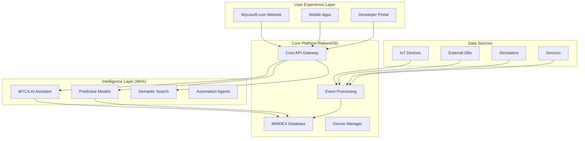

# 🚀 NatureOS-MAS-Website Integration Improvement Plan

## 📋 Executive Summary

This document outlines strategic improvements to enhance the integration between **NatureOS**, **Mycosoft Multi-Agent System (MAS)**, and **Mycosoft.com website**. While the foundational integration is already robust, these improvements will create a seamless, production-grade ecosystem similar to Google's unified platform approach.

## 🎯 Current State Analysis

### ✅ **What's Already Working Well**
- **Core API Integration**: Dedicated Mycosoft endpoints (`/api/mycosoft/*`)
- **Website Components**: Live data dashboard, MYCA chat interface
- **Device Integration**: Mushroom 1 firmware with Mycorrhizae Protocol
- **Data Pipeline**: Event-driven architecture with Azure services
- **Infrastructure**: Production-ready Azure deployment

### 🔧 **Identified Improvement Areas**
- **Real-time Communication**: Enhanced WebSocket/SSE implementation
- **AI/MAS Intelligence**: Deeper integration with predictive capabilities
- **Data Synchronization**: Optimized cross-system data flow
- **User Experience**: Seamless unified interface
- **Observability**: Enhanced monitoring and analytics
- **Performance**: Advanced caching and optimization

---

## 🏗️ Integration Architecture Vision



---

## 🎯 Strategic Improvements

### 1. **Enhanced Real-Time Communication**

#### **Current State**: Basic API polling every 5 seconds
#### **Improvement**: WebSocket + Server-Sent Events (SSE)

**Implementation:**
```csharp
// Add to Program.cs
builder.Services.AddSignalR();

// New SignalR Hub for real-time updates
public class NatureOSHub : Hub
{
    public async Task JoinDeviceGroup(string deviceId)
    {
        await Groups.AddToGroupAsync(Context.ConnectionId, $"device-{deviceId}");
    }
    
    public async Task JoinLocationGroup(double lat, double lng, double radius)
    {
        await Groups.AddToGroupAsync(Context.ConnectionId, $"location-{lat}-{lng}-{radius}");
    }
}

// Enhanced MycosoftIntegrationService
public async Task BroadcastDeviceUpdate(string deviceId, object data)
{
    await _hubContext.Clients.Group($"device-{deviceId}")
        .SendAsync("DeviceUpdate", data);
}
```

**Website Enhancement:**
```javascript
// Enhanced LiveDataComponent.jsx
import { HubConnectionBuilder } from '@microsoft/signalr';

const LiveDataComponent = () => {
    const [connection, setConnection] = useState(null);
    const [liveData, setLiveData] = useState({});
    
    useEffect(() => {
        const newConnection = new HubConnectionBuilder()
            .withUrl(`${process.env.NATUREOS_API_URL}/natureos-hub`)
            .build();
            
        newConnection.start().then(() => {
            newConnection.on('DeviceUpdate', (data) => {
                setLiveData(prev => ({ ...prev, [data.deviceId]: data }));
            });
            
            // Join relevant groups based on user preferences
            newConnection.invoke('JoinLocationGroup', userLat, userLng, 10000);
        });
        
        setConnection(newConnection);
    }, []);
    
    return <div>Real-time data updates...</div>;
};
```

### 2. **Advanced AI/MAS Integration**

#### **Current State**: Basic MYCA query/response
#### **Improvement**: Predictive Analytics + Proactive Insights

**Enhanced MAS Service:**
```csharp
public interface IAdvancedMasService
{
    Task<PredictiveInsight[]> GetPredictiveInsightsAsync(TimeSpan horizon);
    Task<AnomalyAlert[]> GetAnomalyAlertsAsync();
    Task<RecommendedAction[]> GetRecommendedActionsAsync(string userId);
    Task<SemanticSearchResult[]> SearchByIntentAsync(string query, string context);
}

public class AdvancedMasService : IAdvancedMasService
{
    // Predictive model integration
    public async Task<PredictiveInsight[]> GetPredictiveInsightsAsync(TimeSpan horizon)
    {
        var historicalData = await GetHistoricalPatterns();
        var weatherData = await GetWeatherForecast(horizon);
        var deviceHealth = await AssessDeviceHealth();
        
        return await _mlService.PredictFutureStates(historicalData, weatherData, deviceHealth);
    }
    
    // Proactive anomaly detection
    public async Task<AnomalyAlert[]> GetAnomalyAlertsAsync()
    {
        var recentEvents = await GetRecentEvents(TimeSpan.FromHours(1));
        var baselineMetrics = await GetBaselineMetrics();
        
        return await _alarmService.DetectAnomalies(recentEvents, baselineMetrics);
    }
}
```

**Enhanced MYCA Integration:**
```javascript
// Enhanced MycaChatComponent.jsx
const MycaChatComponent = () => {
    const [insights, setInsights] = useState([]);
    const [proactiveAlerts, setProactiveAlerts] = useState([]);
    
    useEffect(() => {
        // Proactive insights every 30 seconds
        const insightInterval = setInterval(async () => {
            const newInsights = await fetch('/api/myca/insights').then(r => r.json());
            setInsights(newInsights);
        }, 30000);
        
        // Real-time alerts via WebSocket
        connection?.on('ProactiveAlert', (alert) => {
            setProactiveAlerts(prev => [alert, ...prev.slice(0, 4)]);
        });
        
        return () => clearInterval(insightInterval);
    }, [connection]);
    
    return (
        <div className="myca-enhanced">
            <ProactiveInsights insights={insights} />
            <AlertsPanel alerts={proactiveAlerts} />
            <ChatInterface />
        </div>
    );
};
```

### 3. **Optimized Data Synchronization**

#### **Current State**: Event-driven with basic caching
#### **Improvement**: Smart Caching + Data Mesh Architecture

**Enhanced Caching Strategy:**
```csharp
public class IntelligentCacheService
{
    private readonly IMemoryCache _cache;
    private readonly IConnectionMultiplexer _redis;
    
    public async Task<T> GetOrSetAsync<T>(string key, Func<Task<T>> getItem, 
        TimeSpan? expiry = null, CacheStrategy strategy = CacheStrategy.Standard)
    {
        // Multi-level caching with intelligent invalidation
        var cacheKey = GenerateIntelligentKey(key, strategy);
        
        // L1: Memory cache (sub-millisecond)
        if (_cache.TryGetValue(cacheKey, out T cachedValue))
            return cachedValue;
            
        // L2: Redis cache (millisecond)
        var redisValue = await _redis.GetDatabase().StringGetAsync(cacheKey);
        if (redisValue.HasValue)
        {
            var value = JsonSerializer.Deserialize<T>(redisValue);
            _cache.Set(cacheKey, value, TimeSpan.FromMinutes(5));
            return value;
        }
        
        // L3: Source data (with intelligent pre-fetching)
        var result = await getItem();
        await SetWithIntelligentExpiry(cacheKey, result, strategy);
        return result;
    }
}
```

**Data Mesh Implementation:**
```csharp
public class DataMeshService
{
    public async Task SynchronizeAcrossEcosystem(MycorrhizaeEvent newEvent)
    {
        // Smart routing based on event type and relevance
        var routingDecisions = await DetermineRouting(newEvent);
        
        var tasks = new List<Task>();
        
        if (routingDecisions.UpdateWebsite)
        {
            tasks.Add(NotifyWebsiteSubscribers(newEvent));
        }
        
        if (routingDecisions.TriggerMasAnalysis)
        {
            tasks.Add(TriggerMasAnalysis(newEvent));
        }
        
        if (routingDecisions.UpdateDeviceSettings)
        {
            tasks.Add(PropagateToDevices(newEvent));
        }
        
        await Task.WhenAll(tasks);
    }
}
```

### 4. **Enhanced User Experience**

#### **Current State**: Separate interfaces for different functions
#### **Improvement**: Unified, Context-Aware Interface

**Unified Dashboard:**
```javascript
// components/UnifiedDashboard.jsx
const UnifiedDashboard = () => {
    const [activeContext, setActiveContext] = useState('overview');
    const [personalizedInsights, setPersonalizedInsights] = useState([]);
    
    return (
        <div className="unified-dashboard">
            <ContextualNavigation 
                context={activeContext}
                onContextChange={setActiveContext}
            />
            
            <DynamicContentArea>
                {activeContext === 'overview' && <OverviewPane />}
                {activeContext === 'devices' && <DeviceManagement />}
                {activeContext === 'analysis' && <AnalyticsPane />}
                {activeContext === 'ai' && <MycaInterface />}
            </DynamicContentArea>
            
            <PersonalizedInsights insights={personalizedInsights} />
            <QuickActions context={activeContext} />
        </div>
    );
};
```

### 5. **Advanced Observability**

#### **Current State**: Basic Application Insights
#### **Improvement**: Full-Stack Observability with AI Insights

**Enhanced Monitoring:**
```csharp
public class IntelligentMonitoringService
{
    public async Task CollectBusinessMetrics()
    {
        var metrics = new
        {
            ActiveDevices = await CountActiveDevices(),
            DataThroughput = await CalculateDataThroughput(),
            UserEngagement = await CalculateUserEngagement(),
            AiAccuracy = await CalculateMycaAccuracy(),
            SystemHealth = await CalculateSystemHealth()
        };
        
        await _telemetryClient.TrackMetric("BusinessMetrics", metrics);
        
        // AI-driven anomaly detection on business metrics
        await DetectBusinessAnomalies(metrics);
    }
    
    public async Task CreatePredictiveAlerts()
    {
        var trends = await AnalyzeTrends();
        var predictions = await _mlService.PredictIssues(trends);
        
        foreach (var prediction in predictions.Where(p => p.Confidence > 0.8))
        {
            await CreateProactiveAlert(prediction);
        }
    }
}
```

---

## 🛠️ Implementation Roadmap

### **Phase 1: Foundation Enhancement (Weeks 1-2)**

#### Week 1: Real-Time Infrastructure
- [ ] **Implement SignalR Hub** in Core API
- [ ] **Add WebSocket support** to website
- [ ] **Create connection management** system
- [ ] **Test real-time data flow** end-to-end

#### Week 2: Enhanced Caching
- [ ] **Implement Redis cache** layer
- [ ] **Add intelligent cache invalidation**
- [ ] **Create cache warming strategies**
- [ ] **Performance test caching impact**

### **Phase 2: AI/MAS Enhancement (Weeks 3-4)**

#### Week 3: Predictive Capabilities
- [ ] **Implement predictive insights service**
- [ ] **Add proactive anomaly detection**
- [ ] **Create recommendation engine**
- [ ] **Integrate ML models for forecasting**

#### Week 4: Semantic Intelligence
- [ ] **Enhance MYCA with context awareness**
- [ ] **Implement semantic search**
- [ ] **Add automated insight generation**
- [ ] **Create learning feedback loops**

### **Phase 3: User Experience (Weeks 5-6)**

#### Week 5: Unified Interface
- [ ] **Design unified dashboard**
- [ ] **Implement context-aware navigation**
- [ ] **Create personalized insights**
- [ ] **Add quick action workflows**

#### Week 6: Mobile & Responsive
- [ ] **Optimize for mobile devices**
- [ ] **Create progressive web app**
- [ ] **Implement offline capabilities**
- [ ] **Add push notifications**

### **Phase 4: Advanced Features (Weeks 7-8)**

#### Week 7: Data Mesh
- [ ] **Implement data mesh architecture**
- [ ] **Add cross-system synchronization**
- [ ] **Create data lineage tracking**
- [ ] **Implement data quality monitoring**

#### Week 8: Advanced Observability
- [ ] **Create business metric dashboards**
- [ ] **Implement predictive monitoring**
- [ ] **Add automated incident response**
- [ ] **Create health scoring system**

---

## 📊 Success Metrics

### **Technical Metrics**
- **Latency Reduction**: < 100ms for real-time updates
- **Cache Hit Rate**: > 90% for frequently accessed data
- **System Availability**: 99.9% uptime
- **Data Freshness**: < 5 seconds for critical updates

### **Business Metrics**
- **User Engagement**: 50% increase in session duration
- **AI Accuracy**: > 95% for MYCA responses
- **Predictive Accuracy**: > 85% for anomaly detection
- **Developer Adoption**: 100+ API calls per day

### **User Experience Metrics**
- **Page Load Time**: < 2 seconds
- **Mobile Performance**: > 90 Lighthouse score
- **User Satisfaction**: > 4.5/5 rating
- **Feature Adoption**: > 70% for new capabilities

---

## 🔧 Technical Specifications

### **Required Dependencies**
```xml
<!-- Add to CoreApi.csproj -->
<PackageReference Include="Microsoft.AspNetCore.SignalR" Version="8.0.0" />
<PackageReference Include="StackExchange.Redis" Version="2.7.4" />
<PackageReference Include="Microsoft.ML" Version="3.0.0" />
<PackageReference Include="Azure.AI.TextAnalytics" Version="5.3.0" />
```

### **Environment Configuration**
```json
{
  "ConnectionStrings": {
    "Redis": "@Microsoft.KeyVault(SecretUri=${keyVault.properties.vaultUri}secrets/RedisConnectionString/)",
    "SignalR": "@Microsoft.KeyVault(SecretUri=${keyVault.properties.vaultUri}secrets/SignalRConnectionString/)"
  },
  "MAS": {
    "PredictionHorizon": "24:00:00",
    "AnomalyThreshold": 0.8,
    "CacheExpiry": "00:15:00"
  }
}
```

### **Infrastructure Updates**
```bicep
// Add to main.bicep
resource signalRService 'Microsoft.SignalRService/signalR@2023-02-01' = {
  name: '${namePrefix}-signalr-${uniqueSuffix}'
  location: location
  sku: {
    name: 'Standard_S1'
    capacity: 1
  }
  properties: {
    features: [
      {
        flag: 'ServiceMode'
        value: 'Default'
      }
    ]
  }
}

resource redisCache 'Microsoft.Cache/redis@2023-08-01' = {
  name: '${namePrefix}-redis-${uniqueSuffix}'
  location: location
  properties: {
    sku: {
      name: 'Standard'
      family: 'C'
      capacity: 1
    }
  }
}
```

---

## 🔐 Security Considerations

### **Enhanced Authentication**
- **JWT token refresh** for long-lived sessions
- **Device certificate management** for IoT security
- **API rate limiting** with intelligent throttling
- **Zero-trust architecture** implementation

### **Data Protection**
- **End-to-end encryption** for sensitive data
- **Personal data anonymization** for GDPR compliance
- **Audit trail enhancement** for all data access
- **Backup encryption** with key rotation

---

## 🎯 Conclusion

This improvement plan transforms the already solid NatureOS-MAS-Website integration into a world-class, unified platform. By implementing these enhancements, you'll achieve:

1. **Seamless Real-Time Experience** - Users get instant updates and insights
2. **Intelligent Automation** - AI proactively identifies issues and opportunities  
3. **Superior Performance** - Sub-second response times with smart caching
4. **Unified User Experience** - All functions accessible through intuitive interface
5. **Production-Grade Observability** - Comprehensive monitoring with predictive alerts

The phased approach ensures minimal disruption while delivering value incrementally. Each phase builds upon the previous, creating a robust, scalable platform that rivals the best integrated ecosystems in the industry.

**Ready to transform your fungal intelligence platform into the next generation of unified ecosystem intelligence!** 🚀 